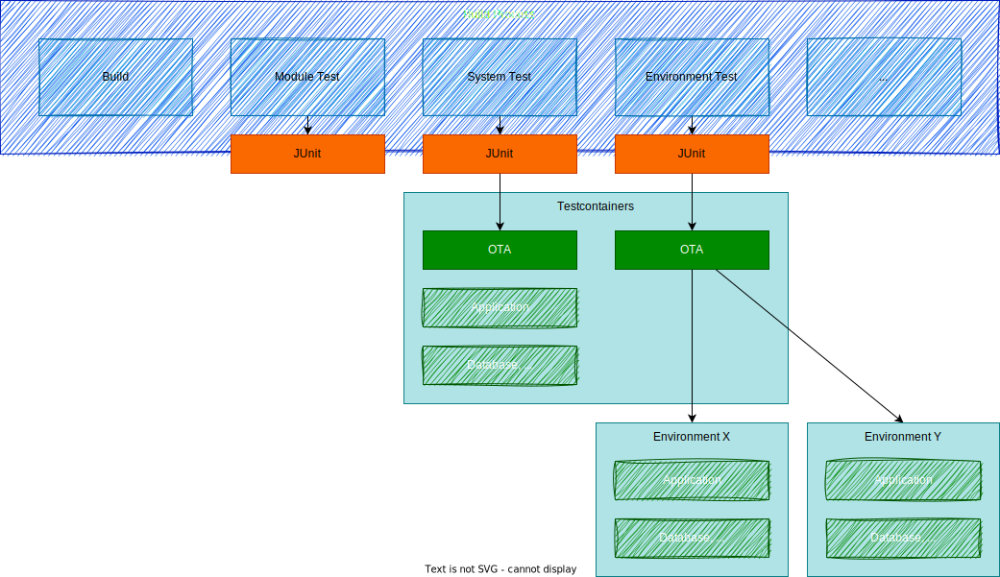

# impl_java_testcontainers

start impl_java as testcontainer to execute test cases with JUnit

Using this approach it is possible to execute existing test cases during maven build.

Here you can find the interesting stuff with auto-detecting of created test cases:

 ### simple (folder "simple")

 [Test Class](simple/src/test/java/com/example/demo/systemtest/OpenTestingSystemTest.java)

`mvn clean install`

### different environments / templating (folder "stagesupport")

Features:

* support maven profiles (one profile for every environment)
* support preparation test cases
* parallel or sequential execution of test cases using annotation (https://github.com/opentestingapi/impl_java_testcontainers/blob/main/stagesupport/execution1/src/test/java/com/example/demo/systemtest/OpenTestingSystemTest.java#L122)
* define repository in testcontainers.properties
* define OTA instance (within testcontainers or external)
* support content replacement in test cases (templating, for example URLs from properties)
* a "virtual environment" instead of testing external ressources (Env2)

[Test Class](stagesupport/execution1/src/test/java/com/example/demo/systemtest/OpenTestingSystemTest.java)

`mvn test -Psystemtest`

`mvn test -Penv1`

`mvn test -Penv2`

(Testcontainers sometimes fails if containers are not available locally and pull takes to long - you should pull them manually before...)

## Example Testing

You can also use it to test a set applications, the same approcach could be used with reduced phases.
